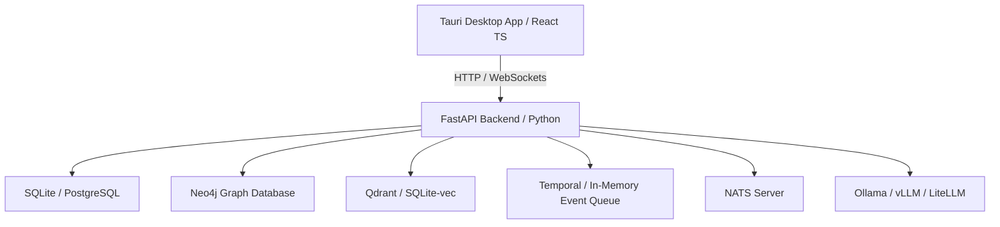

# AI Operating System for Ideas (IdeasOS)

Welcome to the architectural blueprints and technical specifications for the **Open Source AI Operating System for Ideas** (IdeasOS).

IdeasOS is a startup-grade, open-source, local-first platform designed to transform raw ideas (text, voice, sketches, papers) into structured, executable outcomes—such as validated startups, functional application prototypes, structured research papers, or automated business systems.

This repository serves as a production-ready blueprint mapping out the vision, code patterns, schemas, and system layout of the platform.

---

## 🗺️ Master Blueprint Index

The design is decomposed into **30 core architectural chapters**:

### Phase 1: Core Foundation & Product Strategy
1. [Product Vision & Philosophy](blueprint/01_product_vision.md) — The transition from ideas to outcomes.
2. [System Architecture & Topology](blueprint/02_system_architecture.md) — Global architecture and C4 diagram.
3. [Module Architecture](blueprint/03_module_architecture.md) — Technical spec for all 13 modules & custom engines.
4. [Folder Structure](blueprint/11_folder_structure.md) — Tauri + React + FastAPI monorepo layout.
5. [CLI Design](blueprint/23_cli_design.md) — Developer interface and automation piping.

### Phase 2: Data & Knowledge Engineering
6. [Database Design & Relational Schema](blueprint/04_database_design.md) — Core tables, cache, and queues.
7. [Knowledge Graph Schema](blueprint/05_knowledge_graph.md) — Neo4j node-edge properties and queries.
8. [RAG Architecture & Document Ingestion](blueprint/09_rag_architecture.md) — Parsing, chunking, and semantic search.
9. [API Specifications](blueprint/06_api_specifications.md) — FastAPI endpoints and NATS pub/sub message schemas.

### Phase 3: AI Orchestration & Logic
10. [AI Agent Architecture](blueprint/07_ai_agent_architecture.md) — LangGraph state machines and multi-agent coordination.
11. [Prompt Engineering Framework](blueprint/08_prompt_engineering.md) — Specialized agent prompts and structured output parsing.
12. [Workflow Engine Design](blueprint/10_workflow_engine.md) — Temporal state machine specs and long-running job queues.

### Phase 4: UI/UX & Native Applications
13. [UI/UX Design System](blueprint/12_ui_ux_design.md) — Typography, themes, and keyboard shortcut configurations.
14. [Component Library](blueprint/13_component_library.md) — Spec for Graph viewer, code runner, and simulators.
15. [User Flows](blueprint/14_user_flows.md) — Step-by-step interactive navigation paths.
16. [State Management](blueprint/15_state_management.md) — Zustand store and CRDT sync.
17. [Desktop Application Design](blueprint/24_desktop_design.md) — Tauri-native integrations and offline sync.
18. [Mobile Companion Strategy](blueprint/25_mobile_companion.md) — PWA sync, voice notes capture, and offline capabilities.

### Phase 5: Security, SDK, & Ecosystem
19. [Security Architecture](blueprint/16_security_architecture.md) — Threat models, local encryption (AES-256), and Keycloak/Authentik.
20. [Privacy Architecture](blueprint/17_privacy_architecture.md) — Locally redacting PII, GDPR compliance, and offline boundaries.
21. [Plugin SDK](blueprint/20_plugin_sdk.md) — Hooks, WASM sandboxing, and runtime specs.
22. [Extension API](blueprint/21_extension_api.md) — UI injection slots and Graph custom renderers.
23. [Marketplace Architecture](blueprint/22_marketplace.md) — Verification pipelines, package signing, and monetization.

### Phase 6: Testing, Operations, & Optimization
24. [Testing Strategy](blueprint/18_testing_strategy.md) — Pytest, Playwright, agent regressions, and security tests.
25. [Deployment Strategy](blueprint/19_deployment_strategy.md) — Non-Docker setup (native scripts, PM2, systemd).
26. [Performance Optimization](blueprint/26_performance_optimization.md) — DB tuning, lazy loading, and SQLite WAL settings.
27. [Scalability Roadmap](blueprint/27_scalability_roadmap.md) — Moving from local-first single user to distributed cloud.
28. [Open Source Governance](blueprint/28_open_source_governance.md) — Maintainers, steering committee, and RFC process.
29. [Contribution Guidelines](blueprint/29_contribution_guidelines.md) — CLI commands, coding standards (ruff/prettier), PR rules.
30. [Future AI Capabilities](blueprint/30_future_ai.md) — WebGPU local LLMs, self-healing agent loops, and multimodal analysis.

---

## 🛠️ Stack Summary

The entire blueprint centers on **pure open-source technologies**:

- **Frontend**: React, TypeScript, Tailwind CSS, shadcn/ui, Apache ECharts, Tauri.
- **Backend**: Python 3.11+, FastAPI, LangGraph, LlamaIndex, LiteLLM.
- **Data Layers**: SQLite / PostgreSQL, Neo4j, Qdrant / SQLite-vec.
- **Orchestration & Events**: Temporal, NATS.
- **Auth & IAM**: Keycloak / Authentik.
- **Security**: Local AES-256, redacting PII parsers.
